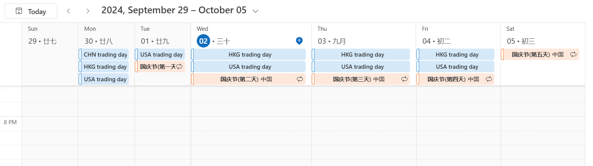

# show_trading_days

Show stock trading days, temporarily support China, Hong Kong SAR and United States 2024.

| Region | Country Code | Exchange |
| --- | --- | --- |
| China | CHN | [Shanghai Stock Exchange (SSE)](https://www.sse.com.cn), [Shenzhen Stock Exchange (SZSE)](https://www.szse.cn) |
| Hong Kong SAR | HKG | [Hong Kong Exchange (HKEX)](https://www.hkex.com.hk) |
| United States | USA | [New York Stock Exchange (NYSE)](https://www.nyse.com), [Nasdaq Stock Market](https://www.nasdaq.com) |

Requires [`pandas`](https://pypi.org/project/pandas/) and [`ics`](https://pypi.org/project/ics/) packages.

``` Shell
python ./2024.py
```

Import the generated `ics` file into your calendar / email client, for example, [Import calendars into Outlook](https://support.microsoft.com/en-us/office/import-calendars-into-outlook-8e8364e1-400e-4c0f-a573-fe76b5a2d379).


